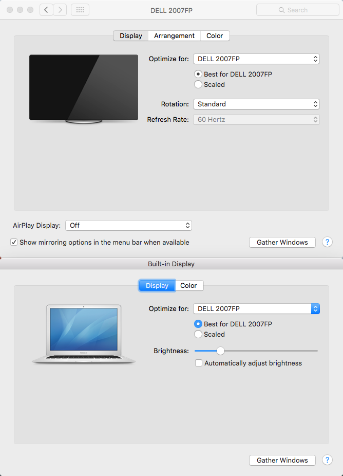

No automatic backlight, please!

## Rationale

If an external display is in use in mirror mode, even if automatic brightness adjustment is set to off, when you close the lid and open it again, internal display's brightness is automatically set to a non-zero value. This is extremely annoying and there's no option to turn internal display off completely when using external one.

## Less fuss

Imagine a magic script that monitors your lid state, and when lid is open, it dims internal display.

Here it is!

## Installation

Put the executable file `nobacklight` to `~/.bin` directory. Then put nobacklight.plist to ~/Library/LaunchAgents.
So this is basically the installation script:

    brew install brightness
    git clone --depth 1 https://github.com/pirj/nobacklight
    cd nobacklight
    mkdir -p ~/.bin
    cp nobacklight ~/.bin
    cp nobacklight.plist ~/Library/LaunchAgents
    launchctl load ~/Library/LaunchAgents/nobacklight.plist

## How does this work

It periodically checks if lid is open. Nothing fancy, it uses command line tools that come with OSX, specifically `ioreg` and `brightness` from homebrew.

## Blah

Author: Phil Pirozhkov

License: MIT
